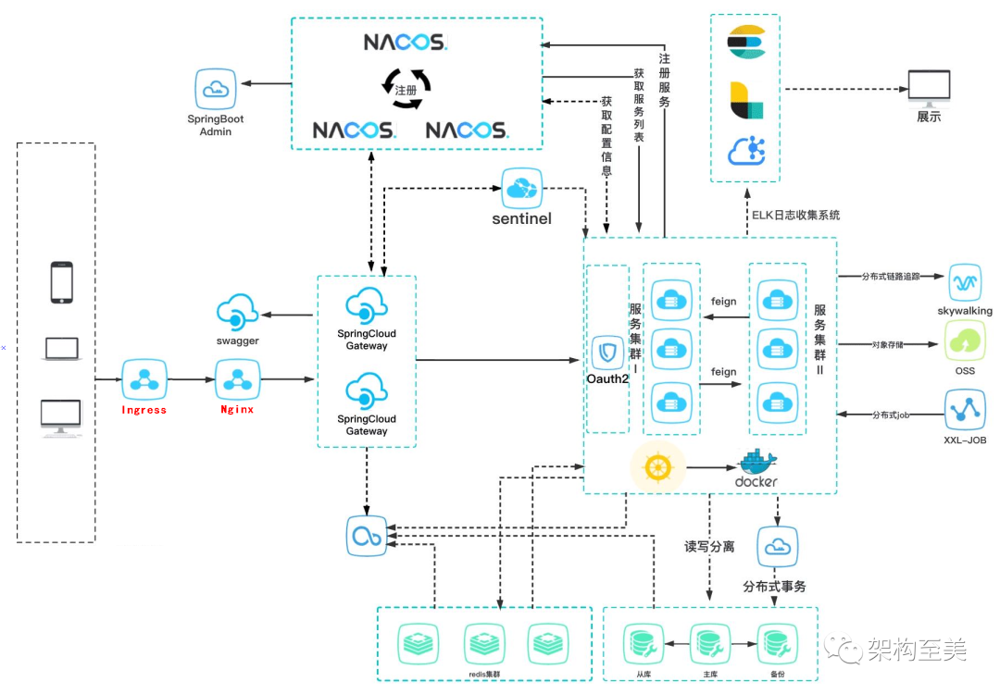
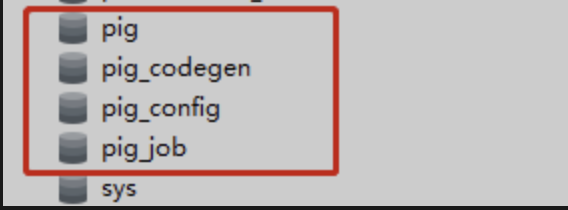

## 整体架构



## 部署环境

K8S环境：

Mysql数据库：采用腾讯云的RDS

Redis数据库：

镜像仓库：采用阿里云的容器镜像服务

## 部署流程

### 导入数据库

登录mysql，导入数据

```mysql
mysql -h gz-cdb-xxxxxxxx.sql.tencentcdb.com -P 57091 -uroot -pxxxx < pig.sql
mysql -h gz-cdb-xxxxxxxx.sql.tencentcdb.com -P 57091 -uroot -pxxxx < pig_codegen.sql
mysql -h gz-cdb-xxxxxxxx.sql.tencentcdb.com -P 57091 -uroot -pxxxx < pig_config.sql
mysql -h gz-cdb-xxxxxxxx.sql.tencentcdb.com -P 57091 -uroot -pxxxx < pig_job.sql
```

登录数据库查看



### 打包并制作镜像

#### 打包后端服务

打包之前要注意是否需要修改nacos的配置文件application.yml的数据库信息，其他服务是否需要修改nacos的信息

打包

```shell
mvn -Dmaven.test.skip=true clean package
```

构建镜像

```shell
cd pig-auth/
docker build -t registry.cn-shenzhen.aliyuncs.com/c-hh/pig-auth:1.0.0 .
```

上传到阿里云镜像服务

```shell
docker login --username=xxxx registry.cn-shenzhen.aliyuncs.com
docker push registry.cn-shenzhen.aliyuncs.com/c-hh/pig-auth:1.0.0
```

其他服务同理

#### 打包前端服务

打包

```shell
cd pig-ui/
npm install&&npm run build:docker
```

构建镜像

```shell
cd docker/
docker build -t registry.cn-shenzhen.aliyuncs.com/c-hh/pig-front:1.0.0 .
```

### 部署服务

先部署后端服务：

由于 pig-gateway,pig-auth,pig-upms-biz 等其它服务都是依赖 nacos(pig-register)服务的，所以我们先发布 pig-register 服务，然后再发布其他服务

再部署前端服务：

```shell
kubectl apply -f pig-front.yaml
```

